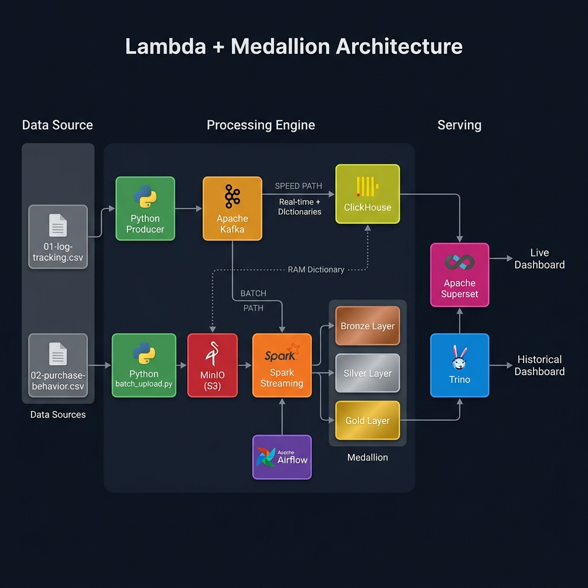
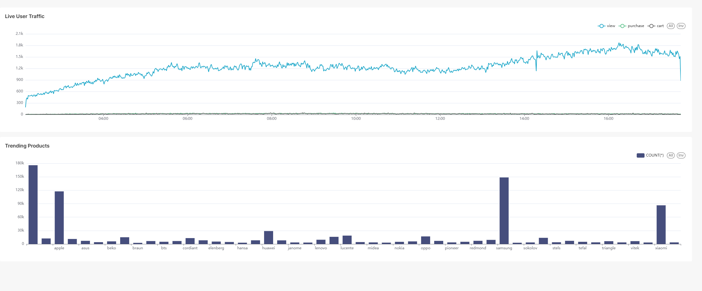

# 🚀 E-Commerce Log Tracking: Modern Data Stack


An end-to-end, fully dockerized **Data Lakehouse** pipeline designed to process e-commerce user interaction logs (views, cart additions, purchases). This project demonstrates a production-grade **Medallion Architecture** (Bronze → Silver → Gold) combined with a **Lambda Architecture** (Speed & Batch layers) using the most cutting-edge open-source data tools available today.

---

## 🏛 Architecture Overview



This project implements a hybrid **Lambda + Medallion Architecture** with two parallel data paths:

### ⚡ Speed Layer (Real-time Analytics)
Raw events flow from a **Python Kafka Producer** through **Apache Kafka** directly into **ClickHouse** via its native Kafka Engine. ClickHouse uses **Materialized Views** to auto-ingest and transform data, and **Dictionaries** (loaded from MinIO into RAM) to enrich real-time logs with static user cohort data — enabling deep, sub-second analytical queries without any batch dependency.

### 🧊 Batch Layer (Medallion Lakehouse)
Simultaneously, **Spark Structured Streaming** consumes the same Kafka topic and writes to an **Apache Iceberg** lakehouse on **MinIO**:
- **Bronze (Raw):** Append-only raw logs ingested every minute.
- **Silver (Enriched):** Airflow triggers Spark batch jobs to JOIN Bronze logs with static user cohort data, deduplicate, and write enriched data.
- **Gold (Business Metrics):** Airflow triggers Spark to compute **9 advanced analytics tables** (Sales Trends, RFM Segmentation, Cohort Retention, Cart Abandonment, and more).

### 📊 Serving Layer
**Apache Superset** connects to both engines:
- **ClickHouse** → Live dashboards with auto-refresh (10s interval).
- **Trino** → Historical/batch dashboards querying Iceberg Gold tables.

---

## 📊 Live Dashboard Preview



> *Real-time Dashboard powered by ClickHouse: Live User Traffic and Trending Products, auto-refreshing every 10 seconds.*

---

## ⚙️ Technology Stack

| Category | Technology | Role in Project |
| :--- | :--- | :--- |
| **Message Broker** | [Apache Kafka](https://kafka.apache.org/) | Ingests real-time e-commerce user interaction logs via Avro serialization. |
| **Schema Registry** | [Confluent Schema Registry](https://docs.confluent.io/platform/current/schema-registry/index.html) | Validates Avro payloads and enforces schema evolution for data contracts. |
| **Stream Processing** | [Apache Spark Streaming](https://spark.apache.org/) | Micro-batch consumer (1-min trigger) writing to Iceberg Bronze layer. |
| **Batch Processing** | [Apache Spark (PySpark)](https://spark.apache.org/) | Distributed ETL engine for Silver enrichment and Gold aggregation. |
| **Storage / Data Lake**| [MinIO](https://min.io/) | S3-compatible object storage holding Iceberg data files and raw CSVs. |
| **Table Format** | [Apache Iceberg](https://iceberg.apache.org/) | ACID transactions, time-travel, and schema evolution for the Data Lakehouse. |
| **Real-time OLAP** | [ClickHouse](https://clickhouse.com/) | Kafka Engine + Materialized Views + **RAM Dictionaries** for enriched real-time analytics. |
| **Query Engine** | [Trino](https://trino.io/) | Distributed SQL engine for ad-hoc queries on Iceberg Gold tables. |
| **Orchestration** | [Apache Airflow](https://airflow.apache.org/) | Schedules and monitors the batch Spark pipelines via a unified `medallion_pipeline` DAG. |
| **Visualization** | [Apache Superset](https://superset.apache.org/) | Interactive BI dashboards over both ClickHouse (Live) and Trino (Historical). |

---

## 📁 Repository Structure

```text
.
├── .github/workflows/
│   └── ci.yml                     # GitHub Actions CI (Pytest + Flake8 + Docker Compose validation)
├── airflow/
│   └── dags/
│       └── dag_medallion_pipeline.py  # Unified DAG: Upload CSV → Bronze→Silver → Silver→Gold
├── clickhouse/
│   ├── init_tables.sql.template   # ClickHouse schema (Kafka Engine, MergeTree, Dictionaries, Views)
│   └── init_clickhouse.py         # Secure credential injection script (Fail-Fast pattern)
├── dataset/
├── images/
│   ├── project_architecture.png   # Architecture diagram
│   └── real-time-dashboard.jpg    # Live dashboard screenshot
├── ingestion/
│   ├── kafka_producer.py          # Avro Kafka Producer (simulates real-time traffic)
│   ├── batch_upload.py            # Standalone MinIO uploader (for local testing)
│   └── requirements.txt           # Python dependencies (confluent-kafka, boto3)
├── spark_jobs/
│   ├── spark_utils.py             # Centralized SparkSession builder (Fail-Fast credentials)
│   ├── streaming_to_bronze.py     # Spark Streaming: Kafka → Iceberg Bronze
│   ├── bronze_to_silver.py        # Spark Batch: Bronze + Cohort JOIN → Silver
│   └── silver_to_gold.py          # Spark Batch: Silver → 9 Gold analytics tables
├── tests/
│   ├── test_spark_jobs.py         # Unit tests for PySpark transformation logic
│   └── test_dags.py               # Airflow DAG integrity tests
├── trino/
│   └── catalog/
│       └── iceberg.properties     # Trino Iceberg REST catalog connector config
├── docker-compose.yaml            # Infrastructure-as-Code (16 containerized services)
├── Dockerfile.airflow             # Custom Airflow image with Docker CLI for spark-submit
├── Makefile                       # Developer shortcuts (up, produce, spark-stream, test, etc.)
├── .env.example                   # Environment variables template (credentials)
├── .pre-commit-config.yaml        # Pre-commit hooks (trailing whitespace, flake8)
├── .flake8                        # Flake8 linting configuration
└── .gitignore                     # Excludes .env, dataset CSVs, logs, checkpoints
```

---

## 🚀 Getting Started

### Prerequisites
- **Docker Desktop** installed (allocate at least **8 GB RAM**, ideally 12 GB+).
- **Python 3.9+** installed on your host machine.
- *(Recommended)* **Make** utility installed (Git Bash, WSL, or Chocolatey on Windows).

### 1. Clone & Configure

```bash
git clone https://github.com/<your-username>/Log_Tracking_Modern_Data_Stack.git
cd Log_Tracking_Modern_Data_Stack

# Create your .env from the template and fill in your credentials
cp .env.example .env
```

### 2. Download Dataset

The raw CSV files (~9 GB) are **not included** in this repository (git-ignored due to size). Download them from Google Drive and place them in the `dataset/` folder:

📥 **[Download Dataset from Google Drive](https://drive.google.com/drive/folders/1nSTzQD2ezMOTgsy5fF9eqpjaDmdwyLPa)**

```text
dataset/
├── 01-log-tracking.csv          
└── 02-purchase-behavior.csv 
```

### 3. Spin Up Infrastructure
Start the distributed stack in a phased approach to ensure proper initialization order:

```bash
# Core Infrastructure (Kafka, MinIO, ClickHouse, Zookeeper, Schema Registry)
make up-step-1

# Iceberg REST Catalog
make up-step-2

# Spark Cluster (Master + Worker)
make up-step-3

# Airflow Backend (Postgres, Redis, Init)
make up-step-4
# ⚠️ Wait for airflow-init container to exit with code 0 before proceeding:
make up-step-5

# Query & Visualization (Trino, Superset)
make up-step-6
```
> **Note:** The first run may take 5–10 minutes to download all Docker images and initialize databases.

### 4. Start Data Ingestion (Simulating Real-time Traffic)
Open a **new terminal** and run the Kafka producer to simulate thousands of users:

```bash
# Create and activate virtual environment
python -m venv .venv
# Windows: .\.venv\Scripts\activate | Linux/Mac: source .venv/bin/activate

# Install dependencies
pip install -r ingestion/requirements.txt

# Start the producer (streams data continuously)
make produce
```

### 5. Start Spark Streaming (Kafka → Bronze Iceberg)
Open **another terminal** and launch the Spark Structured Streaming job:

```bash
make spark-stream
```

<details>
<summary>📌 Click here for manual OS-specific Spark commands</summary>

**Linux/Mac (Bash):**
```bash
docker exec -it spark-master /opt/spark/bin/spark-submit \
  --packages org.apache.spark:spark-sql-kafka-0-10_2.12:3.5.1,org.apache.spark:spark-avro_2.12:3.5.1,org.apache.iceberg:iceberg-spark-runtime-3.5_2.12:1.5.0,org.apache.iceberg:iceberg-aws-bundle:1.5.0 \
  --py-files /opt/spark_jobs/spark_utils.py \
  /opt/spark_jobs/streaming_to_bronze.py
```

**Windows (PowerShell):**
```powershell
docker exec -it spark-master /opt/spark/bin/spark-submit `
  --packages org.apache.spark:spark-sql-kafka-0-10_2.12:3.5.1,org.apache.spark:spark-avro_2.12:3.5.1,org.apache.iceberg:iceberg-spark-runtime-3.5_2.12:1.5.0,org.apache.iceberg:iceberg-aws-bundle:1.5.0 `
  --py-files /opt/spark_jobs/spark_utils.py `
  /opt/spark_jobs/streaming_to_bronze.py
```
</details>

### 6. Initialize ClickHouse (Speed Layer + Dictionaries)
Set up the ClickHouse real-time pipeline: Kafka Engine → MergeTree → Materialized View → RAM Dictionaries → Enriched View.

```bash
make clickhouse-init
```
> This uses a secure Python script (`clickhouse/init_clickhouse.py`) that injects `.env` credentials into the SQL template at runtime — no secrets are ever stored on disk.

### 7. Run Batch Processing Pipelines (Airflow)
1. Navigate to **Airflow UI**: [http://localhost:8080](http://localhost:8080).
2. Login with the credentials you configured in `.env` (defaults: `admin` / your password).
3. **Unpause** the `medallion_pipeline` DAG.

---

## 📊 Analytics & BI (Apache Superset)

Navigate to **Superset UI**: [http://localhost:8088](http://localhost:8088) and login with the same admin credentials.

### Database Connections
Go to **Settings → Database Connections** and add two databases:

| Database | Display Name | SQLAlchemy URI |
| :--- | :--- | :--- |
| **ClickHouse** | `ClickHouse - Speed Layer` | `clickhousedb://default:<your-password>@clickhouse:8123/lakehouse` |
| **Trino** | `Trino - Iceberg Lakehouse` | `trino://admin@trino:8080/iceberg` |

> **Tip:** Set auto-refresh to **10 seconds** on the Real-time Dashboard tab for a live monitoring experience.

---

## 🧪 CI/CD & Testing

This project applies **Software Engineering best practices** to Data Engineering:

### Automated Test Suite
```bash
# Run all tests locally
pip install pytest pyspark==3.5.1 apache-airflow==2.8.0 apache-airflow-providers-docker==3.9.0
pytest tests/ -v
```

### GitHub Actions CI
Every push to `main` automatically triggers (`.github/workflows/ci.yml`):
1. **Flake8 Linting** — Python syntax errors and code style.
2. **Docker Compose Validation** — YAML structure correctness.
3. **Pytest Suite** — All unit tests for Spark and Airflow.

## 🔮 Future Scope (Production Enhancements)

While this project is fully functional as a portfolio/MVP, the following improvements would be necessary for a **production-scale deployment** handling terabytes of data daily:

| Area | Current State | Production Enhancement |
| :--- | :--- | :--- |
| **Small Files** | Spark Streaming appends micro-batches every minute | Add an Airflow DAG to run Iceberg `rewrite_data_files()` and `expire_snapshots()` nightly |
| **Gold Layer** | Full recompute via `createOrReplace()` | Switch to `MERGE INTO` (incremental updates) for efficiency at scale |
| **Alerting** | Manual monitoring via UI | Integrate Airflow Slack/Telegram callbacks + Prometheus/Grafana for Kafka/Spark health |
| **Scalability** | Single-node Docker Compose | Migrate to Kubernetes (K8s) with Helm charts for horizontal scaling |

---

## 🧹 Teardown

To completely shut down the cluster and remove all data volumes:
```bash
docker compose down -v
```